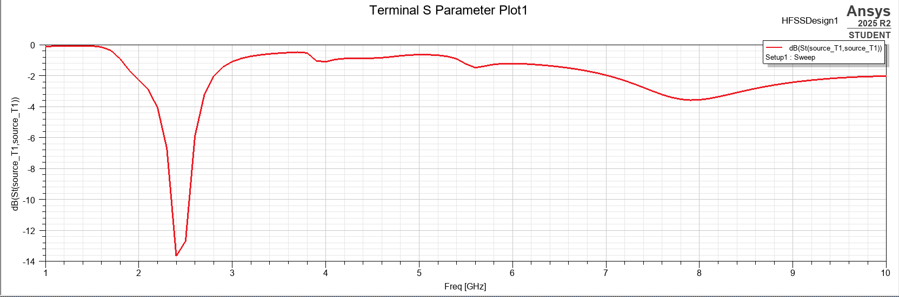
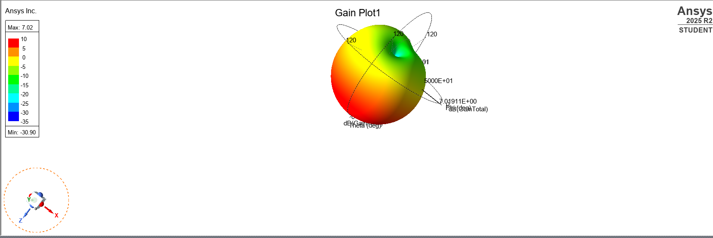

# E-shaped Patch Antenna — Design and Simulation at 2.4 GHz

> Full-wave EM simulation of an E-shaped microstrip patch antenna 
> at 2.4 GHz using ANSYS HFSS 2025 R2.

---

## Antenna Model

> E-shaped patch on dielectric substrate inside radiation boundary box (radbox::143)

---

## Overview

E-shaped microstrip patch antenna designed for the 2.4 GHz ISM band 
(Wi-Fi / Bluetooth / ZigBee). The E-shape is formed by cutting two 
rectangular slots from a standard rectangular patch, which improves 
bandwidth and impedance matching compared to a conventional patch.

---

## Simulation Results

| Parameter            | Value              |
|---|---|
| Resonant Frequency   | 2.4 GHz            |
| Return Loss (S11)    | -13.5 dB @ 2.4 GHz |
| Peak Gain            | 7.02 dBi           |
| Bandwidth (S11<-10dB)| ~200 MHz           |
| Radiation Pattern    | Broadside          |
| Simulator            | ANSYS HFSS 2025 R2 |

---

## S11 Return Loss Plot

> Clear resonance dip at 2.4 GHz with S11 = -13.5 dB — 
> well below the -10 dB threshold for good impedance matching.

---

## 3D Gain Radiation Pattern

> Peak gain of 7.02 dBi with broadside directional radiation.

---

## Repository Structure
Ansys_hfss/
├── README.md
├── simulation/
│   └── patch_antenna.aedt
├── antenna_3d_model.png
├── s11_return_loss.png
└── gain_pattern_3d.png
